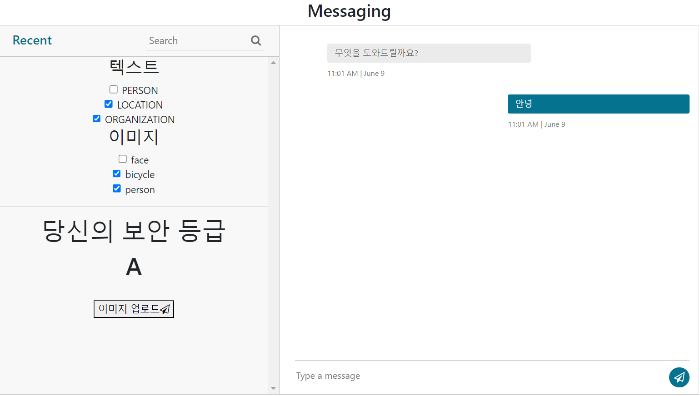
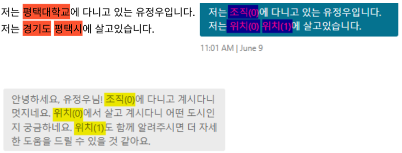
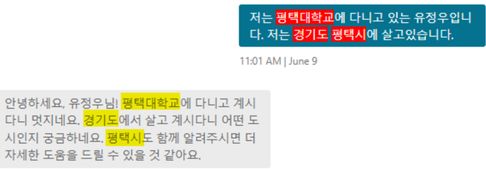
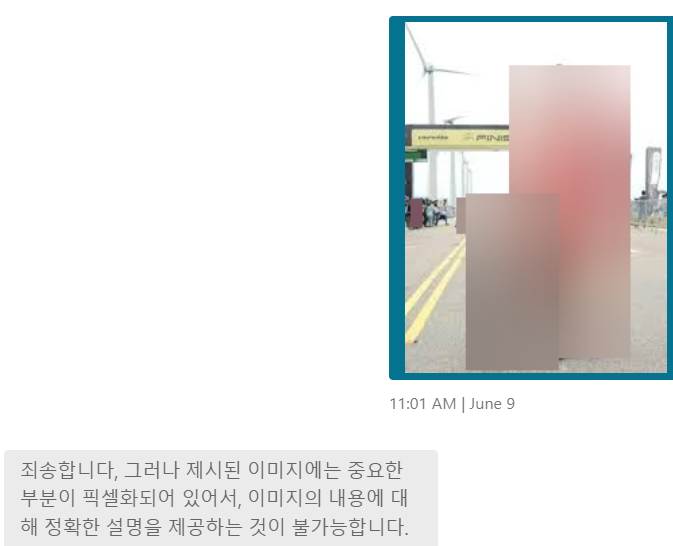
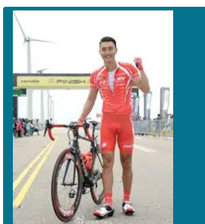
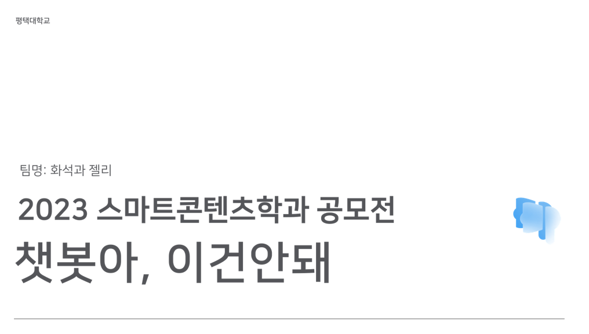

# 챗봇아 그건 안돼
챗봇 사용에서 유출되는 개인정보를 보호하는 프로젝트로 유정민과 이정한이 참여한 프로젝트 입니다.

# 사이트

# 1. 문제점
챗봇을 많이 사용하는 요즘 개인은 무방비로 개인정보가 노출되고, 회사에서는 직원들의 챗봇 사용으로 민감정보 노출을 막기 위해 아예 챗봇 사용을 금지하는 문제점이 있다.

# 2. 개발 기능
**익명화된 문장**  

**복원된 문장**  

**블러링된 이미지**  

**복원된 이미지**  

# 3. 세부기술
## 텍스트
1. NER 모델을 사용해서 개인정보를 탐지
2. 타입별 임시데이터로 변경 (매핑 저장)
3. 챗봇에게 전송 및 응답의 복원

## 이미지
1. 이미지 객체 탐지
2. 객체 블러링
3. 챗봇의 이미지 설명

# 4. 효과 및 향후 계획
**기대효과**  
- 개인: 개인정보 노출없이 사용하며 노출로 인한 범죄가 감소한다.
- 회사: 내부 정보유출로부터 지식재산을 보호할 수 있고, 챗봇의 사용으로 기업의 생산력이 증대된다.

**향후 계획**  
1. 크롬 확장앱: 크롬 확장앱으로 제공하여 사용자의 접근성과 편리성을 높인다.
2. 기업 맟춤 튜닝: NER을 각 기업에 맞는 파인튜닝을 통해 기업과 관련된 정보를 더욱 정확하게 탐지한다.
3. 자동화: 각 사원들은 기업의 맟춤튜닝된 모델을 사용하여 자동으로 텍스트-익명화/이미지-블러링 처리를 한다. (이태규 교수님 아이디어)

# 수상
- 2023 평택대학교 스마트컨텐츠 공모전 은상

# PPT (클릭)

# 빌드방법
1. git clone
2. `pip install -r requirements.txt`
3. `python app.py`
4. `localhost:31313` 접속
5. 텍스트/이미지를 업로드하면 결과를 확인할 수 있습니다.

# 할 것
- 코드 리팩토링
